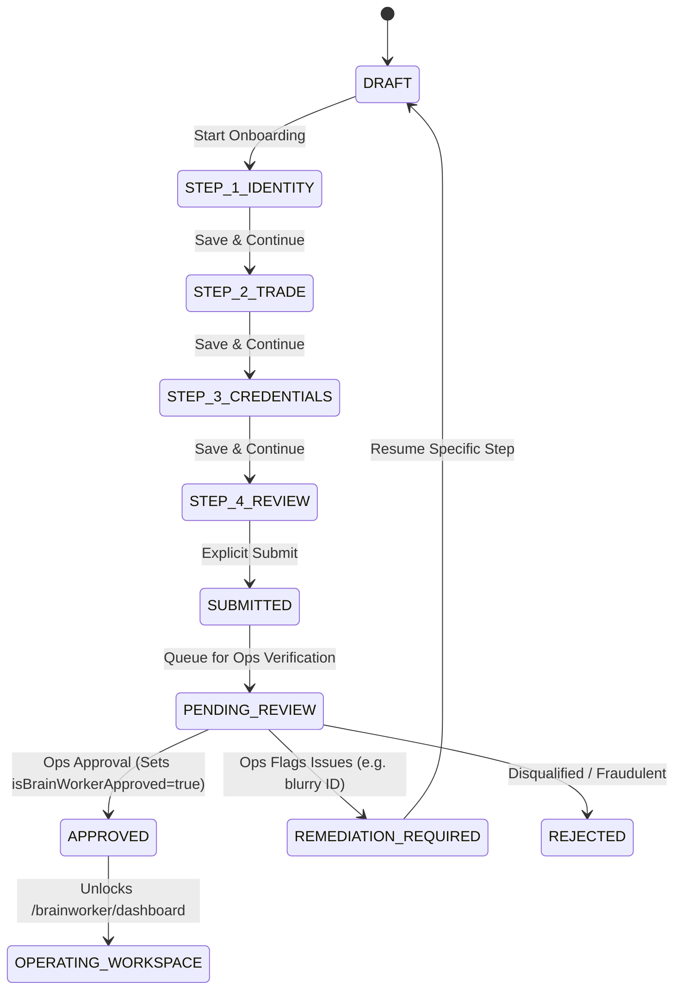

# Spec: BW-001 BrainWorker Platform Onboarding & Identity Verification (v1.0)

| Field | Value |
|---|---|
| **Document ID** | BW-001-SCOPE |
| **Feature** | BrainWorker Onboarding & Identity Verification |
| **Status** | 🟡 Proposed for Scope Approval (v1.0) |
| **Version** | 1.0 |
| **Workstream** | Phase 2: BrainWorker (Service Provider) Web Platform |
| **Governing Loop** | Mr. Solomon 9-Command Engineering Loop (`/scope`) |
| **Target Surfaces** | `/brainworker/register`, `/brainworker/onboarding`, `/brainworker/verification-status` |
| **Date** | 2026-09-24 |

---

## 1. Executive Summary & Core Doctrine

BW-001 establishes the provider onboarding and identity verification foundation for BukieBrainJobs. It marks the formal kickoff of **Phase 2: BrainWorker Web Platform**, bridging prospective service professionals from initial registration into a vetted, verified workforce.

To build trust across the Nigerian marketplace, BukieBrainJobs cannot permit self-certified or instantly approved provider accounts. Every artisan and technician must complete a structured onboarding funnel: submitting legal identity details (NIN/BVN), government-issued identification, trade specialty configuration, and proof of trade competency (trade certifications or apprenticeship letters).

Once submitted, provider profiles enter an asynchronous operational verification workflow. Approved status unlocks the BrainWorker Operating Workspace (`/brainworker/dashboard`), while pending and remediation states provide honest, transparent progress indicators.

### 1.1 Core Doctrine: The Identity Distinction

> **Format validation confirms syntax; verification establishes identity.**
>
> Validating that a National Identity Number (NIN) or Bank Verification Number (BVN) consists of 11 numeric digits confirms syntactic completeness only. It does not establish that the identifier is valid, active, or belongs to the applicant.
>
> The UI copy, error handling, repository methods, and documentation must maintain this strict distinction. Under no circumstances may the application label a format-checked input as "Verified". Verification is an authoritative operational outcome, not a client-side regex match.

### 1.2 Architectural Preconditions & Invariants

1. **Phase 1 Production Re-use**: The customer platform is an established production foundation. BW-001 integrates with existing shared contracts (`AuthUser`, `UserRole`, `isBrainWorkerApproved`, notification channels, and design system tokens) without duplicating session schemes or styling patterns.
2. **Fail-Closed Repository Boundary**: All onboarding operations flow through a dedicated `IBrainWorkerOnboardingRepository`. Unauthorized, unauthenticated, or cross-tenant inspection attempts fail closed.
3. **Physical Testing Separation**: In accordance with the standard enforced across WEB-014 through WEB-018, all test fixtures, harnesses, and controllers reside strictly in `lib/brainworker/testing/`. Production code contains zero imports from `testing/`.
4. **Cloud Codespace Pipeline**: Heavy tests and production builds execute over SSH on cloud Codespace `effective-fishstick-x5qwp6wrrp64fxwx`, protecting the local Termux Android environment.

---

## 2. Registration Boundary

### 2.1 Entry Point: `/brainworker/register`
- Dedicated signup route tailored specifically to tradespeople, technicians, and artisans.
- Provides clear value propositions focused on earnings, guaranteed escrow payouts, and verified customer leads.
- Distinct from the customer registration surface (`/register`), establishing provider intent before account creation.

### 2.2 Relationship to Existing Authentication
- Integrates directly with `apps/web/lib/auth/storage.ts` and `apps/web/lib/auth/types.ts`.
- Calls standard registration logic with explicit role parameter: `role: 'brainworker'`.
- New BrainWorker accounts are initialized with:
  - `role: 'brainworker'`
  - `isBrainWorkerApproved: false`
- Preserves single-session integrity without secondary authentication tokens.

### 2.3 Duplicate-Account & Cross-Role Behavior
- **Existing Provider Account**: If an applicant attempts to register with an email or Nigerian phone number that already exists as a `brainworker`, registration fails with an actionable error and a direct link to sign in (`/login?redirect=/brainworker/onboarding`).
- **Existing Customer Account**: If an applicant's phone number or email is already associated with a `customer` account, the system fails closed with explicit guidance: "This email/phone is already registered as a Customer. To register as a BrainWorker, please use your professional details or sign in to request an account upgrade." Customer accounts are never silently overwritten or mutated into providers.

### 2.4 Authenticated vs. Unauthenticated Routing Boundary
- **Unauthenticated Visitor**:
  - Accessing `/brainworker/register`: Allowed; renders provider registration form.
  - Accessing `/brainworker/onboarding` or `/brainworker/verification-status`: Redirects to `/login?redirect=/brainworker/onboarding`.
- **Authenticated Customer (`role: 'customer'`)**:
  - Accessing `/brainworker/register` or `/brainworker/onboarding`: Blocked with clear explanation: "You are signed in with a Customer account. Provider onboarding requires a BrainWorker account."
- **Authenticated BrainWorker (`role: 'brainworker'`, `isBrainWorkerApproved: false`)**:
  - Accessing `/brainworker/register`: Redirected to `/brainworker/onboarding` (if in draft) or `/brainworker/verification-status` (if submitted).
  - Accessing `/brainworker/dashboard`: Redirected to `/brainworker/verification-status` until approved.
- **Authenticated BrainWorker (`role: 'brainworker'`, `isBrainWorkerApproved: true`)**:
  - Accessing `/brainworker/register` or `/brainworker/onboarding`: Redirected to `/brainworker/dashboard`.

---

## 3. Onboarding Funnel & State Machine

The onboarding journey progresses through a deterministic multi-step state machine with persistent draft recovery.

### 3.1 Funnel Steps

#### Step 1: Legal Identity (`STEP_1_IDENTITY`)
- **Legal Full Name**: First name, middle name (optional), surname (must match legal government ID).
- **Date of Birth**: Day, month, year (applicant must be at least 18 years old).
- **Identity Identifier Selection**:
  - National Identity Number (NIN)
  - Bank Verification Number (BVN)
- **Identifier Input**: Strict 11-digit numeric format validation.
- **Residential / Workshop Address**: Street address, City, LGA, State.

#### Step 2: Trade & Coverage Profile (`STEP_2_TRADE`)
- **Primary Trade Category**: Exactly one primary category selected from the 8 canonical categories.
- **Sub-Specialties**: Up to 5 specific tags describing expert focus (e.g. *Diesel Generators*, *Daikin Inverter Units*, *Borehole Submersible Pumps*).
- **Experience Level**:
  - `APPRENTICE_INTERMEDIATE` (1–3 years)
  - `JOURNEYMAN_EXPERIENCED` (4–7 years)
  - `MASTER_CRAFTSMAN` (8+ years)
- **Years in Trade**: Positive numeric integer (1–50).
- **Active Coverage Cities**: Multi-select from the 7 canonical Nigerian marketplace cities: Lagos, Abuja, Port Harcourt, Ibadan, Benin City, Enugu, Kano (minimum 1 required).

#### Step 3: Documents & Credentials Staging (`STEP_3_CREDENTIALS`)
- **Government-Issued Identity Document**: Mandatory.
- **Trade Certification or Apprenticeship Freedom Letter/Certificate**: Mandatory (at least one valid trade proof).
- **Workshop, Equipment or Past Work Photo**: Optional but recommended.

#### Step 4: Review & Final Declaration (`STEP_4_REVIEW`)
- Complete summary card of identity, trade profile, coverage cities, and staged documents.
- Legal declaration checkbox: "I solemnly declare that the information and documents provided are genuine, valid, and belong to me. I understand that submitting false credentials leads to permanent platform disqualification and legal referral."
- Actionable "Submit Application" button.

---

## 4. Identity Data Boundary & Masking Doctrine

### 4.1 Strict Distinction: Format Validation vs. Verification
- **Format Validation**:
  - NIN: Exactly 11 digits, numeric only (`/^\d{11}$/`).
  - BVN: Exactly 11 digits, numeric only (`/^\d{11}$/`).
  - Evaluated synchronously on client input for basic completeness.
  - UI label: `"11-digit format valid"`.
- **Identity Verification**:
  - Authoritative check validating the identity against official registries or operational reviews.
  - Occurs asynchronously after submission.
  - Never declared by the frontend.

### 4.2 Masking & Redaction Rules
- Once entered, raw NIN or BVN values must be masked when re-displayed on the UI or review summary.
- Format: `•••••••1234` (seven bullet characters followed by the last 4 digits).
- The raw 11-digit string is never rendered into DOM attributes, tooltips, or error toasts.
- Staged draft persistence encrypts or isolates identifier values; they are not dumped into unauthenticated query parameters or browser history.

### 4.3 Authoritative vs. Client State
- Frontend retains draft inputs in local/session memory solely to prevent data loss on page refresh.
- Authoritative lifecycle state (`DRAFT`, `SUBMITTED`, `PENDING_REVIEW`, `APPROVED`, `REMEDIATION_REQUIRED`, `REJECTED`) is governed exclusively by the repository.

---

## 5. Document & Evidence Handling

### 5.1 Supported Document Types
1. **Government Identity Documents**:
   - National Identification Number (NIN) Slip or National e-ID Card (NIMC)
   - Driver's License (FRSC)
   - Permanent Voter's Card (INEC)
   - Nigerian International Passport (NIS)
2. **Trade Competency Proofs**:
   - Federal Ministry of Labour Trade Test Certificate (Grade I, II, or III)
   - Apprenticeship Completion Certificate / Freedom Letter from accredited Master Craftsman or Artisan Association
   - Vocational Training Diploma / Certificate (e.g. NABTEB, City & Guilds)
   - Professional Association Identity Card (e.g. MWUN, NATA, ASWA)
3. **Workshop & Equipment Proofs**:
   - Workshop physical location photo with signboard
   - Tool kit / diagnostic gear inventory photo

### 5.2 Upload Constraints & Staging Behavior
- **Permitted MIME Types**: `image/jpeg`, `image/png`, `image/webp`, `application/pdf`.
- **Maximum File Size**: 5 MB per document.
- **Client-Side Validation**:
  - Files exceeding 5 MB are rejected immediately with a friendly Nigerian-localized error: `"File size exceeds 5 MB. Please choose a smaller photo or document."`
  - Unsupported file types (e.g. `.exe`, `.zip`, `.docx`) are rejected with an explicit format reminder.
- **Staging Preview**:
  - Images display a constrained aspect-ratio thumbnail.
  - PDFs display an accessible document card with file name, page count (if available), and formatted byte size.
- **Replacement & Removal**:
  - While in `DRAFT` or `REMEDIATION_REQUIRED`, every uploaded document features an explicit "Remove" and "Replace" control.
  - No orphaned staging files remain in state upon replacement.

---

## 6. Verification Lifecycle & Operating-Workspace Access

### 6.1 Lifecycle States

| State | Definition | Operating Access (`/brainworker/dashboard`) |
|---|---|---|
| `DRAFT` | Application in progress; steps partially or fully filled but unsubmitted. | ❌ Blocked (routes to `/brainworker/onboarding`) |
| `SUBMITTED` | Application received by system; pending operational queue placement. | ❌ Blocked (routes to `/brainworker/verification-status`) |
| `PENDING_REVIEW` | Identity and credentials under active operational review. | ❌ Blocked (routes to `/brainworker/verification-status`) |
| `REMEDIATION_REQUIRED`| Specific issue flagged (e.g. unreadable ID, expired license); user must update specific field/file. | ❌ Blocked (routes to `/brainworker/onboarding` focused on flagged step) |
| `REJECTED` | Application permanently rejected for fraud or critical disqualification. | ❌ Blocked (routes to `/brainworker/verification-status` with finality) |
| `APPROVED` | All credentials verified. System sets `isBrainWorkerApproved: true`. | ✅ Granted (routes directly to `/brainworker/dashboard`) |

### 6.2 Operating Access Authority: `isBrainWorkerApproved`
- `isBrainWorkerApproved` in auth storage/session is the single source of truth for provider operating permissions.
- The onboarding UI cannot flip `isBrainWorkerApproved` to `true`.
- Approval transitions happen strictly via repository resolution or authoritative backend signal.

---

## 7. Security, Tenant Isolation & Privacy

1. **Strict Customer Isolation**:
   - Customers (`role: 'customer'`) have no access to provider onboarding state.
   - Any customer token attempting to call `IBrainWorkerOnboardingRepository` throws `UnauthorizedError`.
2. **Provider Isolation**:
   - A BrainWorker applicant can only query, save, or view their own onboarding draft and documents.
   - Cross-applicant inspections throw `UnauthorizedError` and fail closed.
3. **Sensitive Document Protection**:
   - Uploaded document previews use secure blob URLs or isolated signed references.
   - No document paths or applicant IDs are guessable or enumerable.
4. **Prerender & Static Generation Safety**:
   - All browser-specific globals (`window`, `document`, `navigator`, `localStorage`, `FileReader`, `URL.createObjectURL`) are wrapped in client-side lifecycle guards.
   - Next.js static page generation for `/brainworker/register`, `/brainworker/onboarding`, and `/brainworker/verification-status` compiles cleanly with zero reference errors.

---

## 8. Physical Testing & Repository Boundary

- **Production Modules**:
  - `apps/web/app/brainworker/register/page.tsx`
  - `apps/web/app/brainworker/onboarding/page.tsx`
  - `apps/web/app/brainworker/verification-status/page.tsx`
  - `apps/web/components/brainworker/onboarding/*`
  - `apps/web/lib/brainworker/*`
- **Testing Modules**:
  - `apps/web/lib/brainworker/testing/*` (test harnesses, deterministic scenario controllers, mock stores)
  - Unit, component, and integration tests (`*.test.tsx`, `*.test.ts`)
- **Strict Boundary Rule**:
  - Zero imports from `lib/brainworker/testing/` in any production file.
  - Verified via physical boundary grep during every verification gate.

---

## 9. Explicit Exclusions (Out of Scope for BW-001)

To protect the delivery cadence and prevent scope creep, the following capabilities are explicitly deferred:

1. **Live NIMC / NIBSS / BVN Provider APIs**: Automated third-party identity verification API integrations belong to Phase 5. In BW-001, identity intake enforces format validation, document staging, and deterministic repository lifecycles.
2. **Admin Moderation Console**: The internal back-office portal where administrators review and approve BrainWorker applications belongs to Milestone 8 (`/admin`).
3. **Instant Automated Approvals**: The platform explicitly disallows instant approval. All applications require operational queue placement.
4. **BrainWorker Marketplace Leads & Lead Dispatch**: Receiving job notifications, accepting bookings, and quoting rates belongs to subsequent Phase 2 milestones (`BW-002`, `BW-003`).
5. **Bank Account & Payout Setup**: Setting up Nigerian bank accounts for direct payout belongs to Milestone 5 (`/brainworker/wallet`).
6. **Background Check Telephony**: Automated phone calls or physical field verification agents are out of scope for web onboarding.

---

## 10. Acceptance & Completion Criteria

BW-001 will be considered complete and ready for production sign-off when:

- [ ] `/brainworker/register` creates dedicated BrainWorker accounts with initial `isBrainWorkerApproved: false`.
- [ ] Multi-step onboarding funnel guides the applicant through Identity, Trade, Credentials, and Review steps.
- [ ] Format validation strictly distinguishes syntactic checks from authoritative identity verification.
- [ ] Sensitive identifiers (NIN, BVN) are masked with only the last 4 digits visible after input.
- [ ] Document staging validates MIME types and enforces the 5 MB ceiling with preview, remove, and replace capabilities.
- [ ] Deterministic states cover `DRAFT`, `SUBMITTED`, `PENDING_REVIEW`, `REMEDIATION_REQUIRED`, `REJECTED`, and `APPROVED`.
- [ ] `isBrainWorkerApproved: true` is granted only upon verified approval, cleanly unlocking the operating workspace.
- [ ] Full suite of automated tests covers domain types, repository methods, document validation, funnel step components, and route integration with zero regressions.
- [ ] Physical boundary inspection confirms 0 `testing/` imports in production code.
- [ ] Next.js production build cleanly generates all new static routes.
